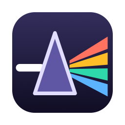
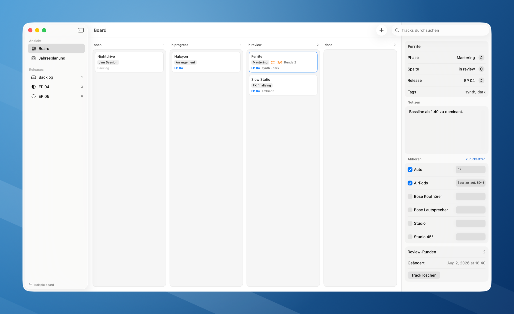

<p align="center">
  
</p>

<h1 align="center">Foton Kanban</h1>

A native macOS kanban app for running music production in a home or project
studio. One card is one song. Everything lives in plain Markdown files, one per
track, so the data outlives the app and syncs with whatever you already use.



> **Note on language:** the user interface is in German, and so is
> [`SPEC.md`](SPEC.md), which documents the data model and the reasoning behind
> it. This README is the English entry point. Localisation is not planned right
> now — see [Roadmap](#roadmap).

## Why files

Studio work spreads across machines. Rather than run a server or a database,
Foton Kanban keeps each track and each release in its own Markdown file inside a
folder you choose. That folder can sit in Nextcloud, Dropbox, iCloud, or a Git
repository.

The design follows from that: **a board action touches exactly one file.**
There is no central index and no ordering file, because those are precisely the
files that two machines fight over. Moving a card writes one field in one file.

## The model

**Four columns** — `open`, `in progress`, `in review`, `done`. The vertical
position inside a column *is* the priority: whatever sits at the top is what you
work on next.

**Phase is an attribute of the track**, not a board axis — Jam Session,
Arrangement, Mixdown, FX finalizing, Mastering. It shows as a badge on the card.
Think of the phases as subdivisions of "in progress".

**One automatic rule.** Drag a card from `in review` to `done` and the review
counts as passed: before mastering the track advances one phase and returns to
`in progress`; after mastering it is finished and stays in `done`. Everything
else is a plain column change. A track that fails review goes back to
`in progress` and keeps its phase.

**A listening checklist per track** — car, AirPods, Bose headphones, Bose
speakers, the studio monitors, and the master heard 45° off-axis from the
speaker. Headphones and speakers of the same brand sound different enough to
deserve their own line. The situations are configured once
in `.foton/config.md` and the track only stores the ticks and notes, so adding a
new listening position makes it appear on every track at once. Progress shows as
`2/6` on the card while a track is being mastered.

## Hearing the current bounce

Point the app at the folder where your preview bounces live and it links them
to cards by itself:

```markdown
previews-root: ~/Music/Previews
```

The song name is read out of the file name — the date may sit at the front or
the back, a time, a `preview` or `MASTER` marker and a leading track number are
all recognised:

```
Ferrite preview 2022-12-28.mp3
2025-03-22 2030 Halcyon.mp3
7_Nightdrive 2026-05-03 Master.aif
```

The newest file wins, so the link stays current the moment you drop a new
bounce in the folder — nothing is stored on the card. A speaker icon appears
on cards that have one; clicking it opens the file in your default player. The
inspector lists older versions with their dates for comparison.

Matching tolerates typos on both sides, on either the file or the card. On a
real catalogue of 1377 files against 81 tracks, 66 tracks found their bounce
with no manual work, and every fuzzy match was correct — transposed letters and
misspelled words included.

Where the name is too different, drag the audio file from Finder onto the card.
That writes an `audio:` entry into the track file which then takes precedence;
"Zuordnung lösen" in the inspector removes it again.

## Requirements

- macOS 14 or newer
- Xcode 26 / Swift 6.2 or newer to build

## Build and run

Open `FotonKanban.xcodeproj` in Xcode and press ⌘R, or from the command line:

```bash
xcodebuild -project FotonKanban.xcodeproj -scheme FotonKanban -destination 'platform=macOS,arch=arm64' build
```

Run the core tests:

```bash
swift test --package-path FotonKanbanCore
```

## First launch

The app asks for a folder and creates `tracks/`, `releases/` and
`.foton/config.md` inside it. Point it at an empty folder to start fresh, or at
`Beispielboard/` in this repository to see it with sample data. The chosen
folder is remembered as a bookmark, so moving or renaming it later does not
break the link.

## File format

```markdown
---
id: k3f9
title: Ferrite
phase: mastering
status: review
release: r-2026-09
order: 1000
review-rounds: 2
created: 2026-06-14T09:12:00+02:00
updated: 2026-08-02T18:40:00+02:00
tags: [synth, dark]
---

## Notizen

Bass line from 1:40 is too dominant.

## Checkliste

- [x] Auto — ok
- [x] AirPods — too much bass, 80–120 Hz
- [ ] Bose Kopfhörer
- [ ] Bose Lautsprecher
- [ ] Studio
- [ ] Studio 45°
```

`order` uses steps of 1000 so a card can be inserted between two others without
touching its neighbours. The parser is deliberate about leaving things alone:
frontmatter keys and body sections it does not recognise survive a
read–write cycle unchanged.

## Layout

| Path | Contents |
|---|---|
| `FotonKanbanCore/` | Swift package: model, Markdown codec, file store, folder watching |
| `FotonKanban/` | App target: board, inspector, year planning |
| `Tools/jira_import.py` | Jira Cloud importer |
| `Beispielboard/` | Sample board |

All logic lives in the package; the app is the surface on top of it. The
`TrackStore` protocol is the seam where a different backend could attach.

## Importing from Jira Cloud

`Tools/jira_import.py` turns Jira issues into tracks. It needs no dependencies
beyond Python 3. Credentials come from the environment and are never read from
the repository:

```bash
export JIRA_SITE=https://yoursite.atlassian.net
export JIRA_EMAIL=you@example.com
export JIRA_TOKEN=…   # https://id.atlassian.com/manage-profile/security/api-tokens
```

Look at your own Jira structure first — projects, issue types, statuses, labels:

```bash
python3 Tools/jira_import.py inspect
```

Then a dry run that writes nothing:

```bash
python3 Tools/jira_import.py import --board MyBoard --jql 'project = ABC' --dry-run
```

> **The mapping tables at the top of `Tools/jira_import.py` describe one
> particular Jira installation** — including a status literally named `Ready?`
> and labels `A`/`B`/`C` used as priorities. Read `inspect` output first and
> adjust `STATUS_MAP`, `PHASE_KEYWORDS`, `LABEL_PRIORITY` and `RELEASE_SOURCE`
> to your own setup. Importing without doing that will put everything in the
> wrong column.

Default mapping:

| Jira | Foton Kanban |
|---|---|
| Project | Release |
| Story, Task | Track |
| Sub-task | Checklist inside the parent track's notes |
| Status | Column — and phase, if the name mentions one |
| Status `Done` | Additionally sets phase to Mastering |
| Label `A`/`B`/`C` | Position in the column, A on top |
| Description | Notes (ADF converted to Markdown) |

Imports are repeatable. Every generated track carries its Jira key in the
frontmatter, so a second run refreshes titles, notes, column, phase and release
from Jira while leaving your priority ordering, review count and listening
checklist untouched.

Note that Atlassian's newer scoped API tokens do not work against
`yoursite.atlassian.net` at all — they only work through `api.atlassian.com`
with a cloud ID. The script resolves that automatically.

## Roadmap

Version 1 is local: one machine, no network. Next up is Git-based
synchronisation between machines — automatic commits on change, pull and push
on window focus, conflicts surfaced in the app. See [`SPEC.md`](SPEC.md) for
the full picture.

Deliberately out of scope: time tracking and invoicing, file attachments,
multi-user support, iOS.

## License

GPL-3.0. See [`LICENSE`](LICENSE).
